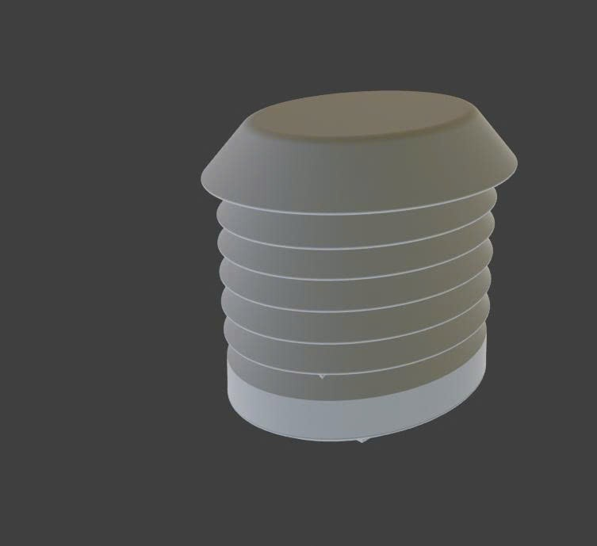

# ☀️ IoT-Based Solar-Powered Weather & Air Quality Monitoring Station


> An IoT-based environmental monitoring station powered entirely by solar energy. It measures real-time weather and air quality data using multiple sensors on an ESP8266, publishes data over MQTT, and visualises it in a responsive web dashboard with live charts, weather forecasting, and CSV export.

---

## 📋 Table of Contents

- [System Architecture](#-system-architecture)
- [Hardware Components](#-hardware-components)
- [Enclosure & Physical Build](#-enclosure--physical-build)
- [Getting Started](#-getting-started)
  - [Firmware](#firmware)
  - [Web Dashboard](#web-dashboard)
- [MQTT Topics](#-mqtt-topics)
- [Live Demo](#-live-demo)
- [Project Structure](#-project-structure)
- [Research Background](#-research-background)
- [Team](#-team)
- [License](#-license)
- [Acknowledgements](#-acknowledgements)

---

## 🏗 System Architecture

The system is built around a **3-layer architecture**:

```
┌─────────────────────────────────────────────────────────────┐
│  Layer 3 — Communication & Display                          │
│  Wi-Fi → MQTT / HTTP → Web Dashboard (GitHub Pages)        │
└───────────────────────────┬─────────────────────────────────┘
                            │
┌───────────────────────────▼─────────────────────────────────┐
│  Layer 2 — Sensor & Processing                              │
│  ESP8266 NodeMCU                                            │
│  ├── I2C: BMP280 + ENS160 + AHT2x                          │
│  ├── UART: PMS7003 (PM2.5)                                  │
│  └── ADC: GUVA-S12SD (UV Index)                             │
└───────────────────────────┬─────────────────────────────────┘
                            │
┌───────────────────────────▼─────────────────────────────────┐
│  Layer 1 — Power                                            │
│  Solar Panel 6V 6W → BMS 2S → LM2596 Buck → 3.3V / 5V     │
└─────────────────────────────────────────────────────────────┘
```

See [`docs/architecture.md`](docs/architecture.md) for a detailed description including data flow and duty-cycling strategy.

---

## 🔧 Hardware Components

| Component | Role | Interface |
|---|---|---|
| ESP8266 NodeMCU | Central MCU | Wi-Fi, GPIO |
| BMP280 | Barometric pressure & temperature | I2C |
| ENS160 | Air quality — AQI, eCO2, TVOC | I2C |
| AHT2x | Temperature & Humidity | I2C |
| PMS7003 | PM2.5 particulate matter | UART |
| GUVA-S12SD | UV Index | Analog (ADC) |
| Solar Panel 6V 6W | Primary power source | — |
| BMS 2S + LM2596 | Battery management & voltage regulation | — |

Full specifications are in [`docs/hardware.md`](docs/hardware.md). Wiring diagrams are in [`docs/wiring.md`](docs/wiring.md).

---

## 📦 Enclosure & Physical Build

The station is housed in a weatherproof sensor shield enclosure designed for outdoor deployment. The multi-layer structure allows airflow around the sensors while protecting them from direct sunlight and rain.




See [`docs/hardware.md`](docs/hardware.md) for full enclosure photos and component placement details.

---

## 🚀 Getting Started

### Firmware

1. **Install Arduino IDE** (1.8.x or 2.x) from [arduino.cc](https://www.arduino.cc/en/software)
2. **Add ESP8266 board package** — in Preferences add this URL to Additional Boards Manager URLs:
   ```
   https://arduino.esp8266.com/stable/package_esp8266com_index.json
   ```
   Then install the **esp8266 by ESP8266 Community** package via Boards Manager.
3. **Install required libraries** — see [`firmware/libraries.md`](firmware/libraries.md)
4. **Configure credentials** — open `firmware/main/main.ino` and update:
   ```cpp
   // TODO: Replace with your credentials
   const char* ssid     = "YOUR_WIFI_SSID";
   const char* password = "YOUR_WIFI_PASSWORD";
   const char* mqtt_server = "broker.hivemq.com";
   ```
5. **Select board & port** — Tools → Board → ESP8266 → NodeMCU 1.0 (ESP-12E)
6. **Upload** — click the Upload button (▶)
7. **Monitor** — open Serial Monitor at 115200 baud to verify sensor output

See [`firmware/README.md`](firmware/README.md) for the complete guide.

### Web Dashboard

1. **Local use** — simply open `web/dashboard.html` in any modern browser. No build step required.
2. **GitHub Pages** — the dashboard is automatically deployed on every push to `master`. Visit the live URL below.

See [`web/README.md`](web/README.md) for MQTT configuration details.

---

## 📡 MQTT Topics

| Topic | Payload | Description |
|---|---|---|
| `simon_house/air/temp` | float (e.g. `28.5`) | Temperature in °C |
| `simon_house/air/hum` | float (e.g. `72.1`) | Relative humidity in % |
| `simon_house/air/pm25` | float (e.g. `15.3`) | PM2.5 concentration in µg/m³ |
| `simon_house/air/aqi` | int 1–5 | Air Quality Index (1 = Excellent, 5 = Severe) |
| `simon_house/air/eco2` | int (ppm) | Equivalent CO₂ concentration |
| `simon_house/air/tvoc` | int (ppb) | Total Volatile Organic Compounds |
| `simon_house/air/uv` | float | UV Index |
| `simon_house/air/alert` | string | System alert message |

---

## 🌐 Live Demo

The dashboard is hosted on GitHub Pages and updates automatically on every push:

🔗 **[https://nguyenchan2005.github.io/Research-and-Development-of-an-IoT-Based-Solar-Powered-Weather-and-Air-Quality-Monitoring-Station/](https://nguyenchan2005.github.io/Research-and-Development-of-an-IoT-Based-Solar-Powered-Weather-and-Air-Quality-Monitoring-Station/)**

---

## 📁 Project Structure

```
/
├── README.md                          ← This file
├── LICENSE                            ← MIT License
├── .gitignore
│
├── firmware/                          ← ESP8266 embedded C++ code
│   ├── main/
│   │   └── main.ino                   ← Main firmware (translated to English)
│   ├── libraries.md                   ← Required Arduino libraries
│   └── README.md                      ← Firmware setup guide
│
├── web/                               ← Web dashboard
│   ├── dashboard.html                 ← Single-page dashboard (MQTT + Chart.js)
│   └── README.md                      ← Dashboard setup guide
│
├── docs/                              ← Documentation
│   ├── architecture.md                ← 3-layer system architecture
│   ├── hardware.md                    ← Hardware components reference
│   ├── wiring.md                      ← Wiring and circuit description
│   └── evaluation.md                  ← Test results and evaluation
│
└── .github/
    └── workflows/
        ├── static.yml                 ← Original GitHub Pages deploy workflow
        └── deploy-pages.yml           ← Updated deploy workflow for web/
```

---

## 📖 Research Background

Air pollution is a growing concern in Vietnamese urban environments, particularly in Ho Chi Minh City, where rapid industrialisation and dense traffic contribute to elevated concentrations of PM2.5 and other pollutants. Existing commercial monitoring equipment is expensive, proprietary, and not widely accessible to researchers or communities.

This project explores a low-cost, open-source, solar-powered alternative that integrates multiple IoT sensors onto a single ESP8266 platform. By combining reliable embedded firmware, MQTT-based telemetry, and a browser-based dashboard, the station provides continuous, real-time environmental data without reliance on mains electricity — making it suitable for deployment in remote or off-grid locations.

The work was carried out as part of an academic research project at HUFLIT University, following sensor calibration and evaluation methodologies informed by World Meteorological Organization (WMO) guidelines for environmental monitoring.

---

## 👥 Team

| Name | Role |
|---|---|
| Nguyễn Việt Chân | Firmware, MQTT integration, project lead |
| Đỗ Minh Phúc | Hardware design, wiring, power management |
| Hà Thanh Sang | Web dashboard, documentation |

---

## 📄 License

This project is licensed under the **MIT License** — see the [LICENSE](LICENSE) file for details.

---

## 🙏 Acknowledgements

- Built as part of academic research at **HUFLIT University** (Ho Chi Minh City University of Foreign Languages and Information Technology)
- Sensor calibration methodology references **WMO** (World Meteorological Organization) standards for environmental monitoring
- Dashboard weather data provided by [Open-Meteo](https://open-meteo.com/) (free, open-source weather API)
- MQTT broker services provided by [HiveMQ](https://www.hivemq.com/)
