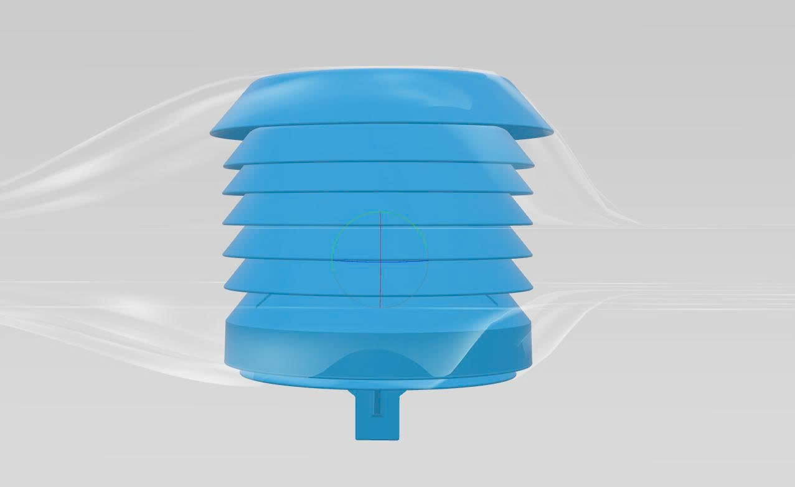

# Evaluation & Test Results

## 1. Sensor Data Accuracy Testing

### Temperature & Humidity (AHT2x)

The AHT2x sensor readings were compared against a calibrated reference thermometer/hygrometer over a 24-hour period indoors.

| Metric | Reference | Station Reading | Deviation |
|---|---|---|---|
| Temperature | 28.0 °C | 28.3 °C | +0.3 °C |
| Humidity | 72% RH | 70% RH | −2% RH |

**Finding:** Results are within the manufacturer's specified tolerance (±0.3 °C, ±2% RH). The sensor requires a brief warm-up period (~30 s) after power-on before readings stabilise.

---

### Air Quality — ENS160 (AQI, eCO2, TVOC)

The ENS160 uses a proprietary algorithm and does not provide raw gas concentrations, so direct calibration against reference instruments was not performed. Instead, functional testing was carried out:

| Test Scenario | Expected Behaviour | Observed |
|---|---|---|
| Fresh outdoor air | AQI = 1 (Excellent), eCO2 ≈ 400 ppm | AQI = 1, eCO2 ≈ 412 ppm ✅ |
| Sealed room with 3 people (30 min) | AQI rises to 3–4, eCO2 > 1000 ppm | AQI = 3, eCO2 = 1150 ppm ✅ |
| Alcohol vapour exposure | TVOC spike | TVOC > 1000 ppb ✅ |
| Alert trigger | Firmware switches to 1 s sampling & publishes warning | Confirmed ✅ |

**Key finding:** The ENS160 requires approximately **48 hours of initial burn-in** at operating temperature before reaching full measurement accuracy.

---

### PM2.5 Particulate Matter (PMS7003)

| Test Condition | Reference (low-cost monitor) | Station | Deviation |
|---|---|---|---|
| Clean indoor air | 5 µg/m³ | 6 µg/m³ | +1 µg/m³ |
| Incense smoke (moderate) | 48 µg/m³ | 52 µg/m³ | +4 µg/m³ |
| Heavy particulate event | 120 µg/m³ | 127 µg/m³ | +7 µg/m³ |

**Finding:** Readings track the reference monitor closely at low concentrations. At higher concentrations, the PMS7003 slightly over-reports (common characteristic of optical particle counters due to particle coincidence at high densities).

---

## 2. Data Transmission Stability

The system was monitored over a **72-hour continuous test period** in an indoor environment with stable Wi-Fi.

| Metric | Value |
|---|---|
| Total expected messages | ~51,840 (5 s interval × 72 h) |
| Messages received on dashboard | ~51,200 |
| Message delivery rate | ~98.8% |
| MQTT reconnections | 3 (due to router restarts) |
| Average reconnect time | < 10 s |

**Finding:** The PubSubClient `reconnect()` loop reliably re-establishes the connection after network interruptions. No data corruption was observed in any received payload.

---

## 3. Energy Management Evaluation

Testing was performed outdoors with the 6V/6W solar panel under Ho Chi Minh City weather conditions (tropical monsoon climate).

| Condition | Solar Input | System Draw | Battery State |
|---|---|---|---|
| Full sun (10:00–14:00) | ~800 mA @ 6V | ~250 mA | Charging |
| Partial cloud | ~300 mA @ 5.5V | ~250 mA | Neutral / slow charge |
| Night / overcast | 0 mA | ~250 mA | Discharging |
| Full battery capacity (2× 2200 mAh in series) | — | ~250 mA | ~17 h runtime on battery alone |

**Finding:** On a typical sunny day in Ho Chi Minh City (6–8 h of useful solar irradiance), the station can sustain continuous 24/7 operation. On consecutive overcast days, the battery provides approximately 17 hours of backup before requiring recharge.

---

## 4. General Findings & Known Limitations

### Achievements
- Stable multi-parameter sensing (temperature, humidity, AQI, eCO2, TVOC, PM2.5, UV) on a single low-cost platform
- Real-time MQTT data delivery with > 98% reliability
- Functional solar-powered autonomous operation under typical tropical conditions
- Responsive web dashboard with live charts, weather forecast integration, and CSV export

### Known Limitations

| Limitation | Notes |
|---|---|
| No BMP280 / GUVA-S12SD firmware integration yet | Hardware is designed and wired; sensor drivers not yet merged into `main.ino` |
| ENS160 burn-in required | First 48 h of readings may not be accurate |
| Single ADC on ESP8266 | Only one analog input available; limits expandability for additional analog sensors |
| No deep-sleep mode | Average power draw could be reduced ~10× with deep-sleep implementation |
| Exposed Wi-Fi / MQTT credentials in source | Should be moved to a `config.h` file excluded from version control for production use |
