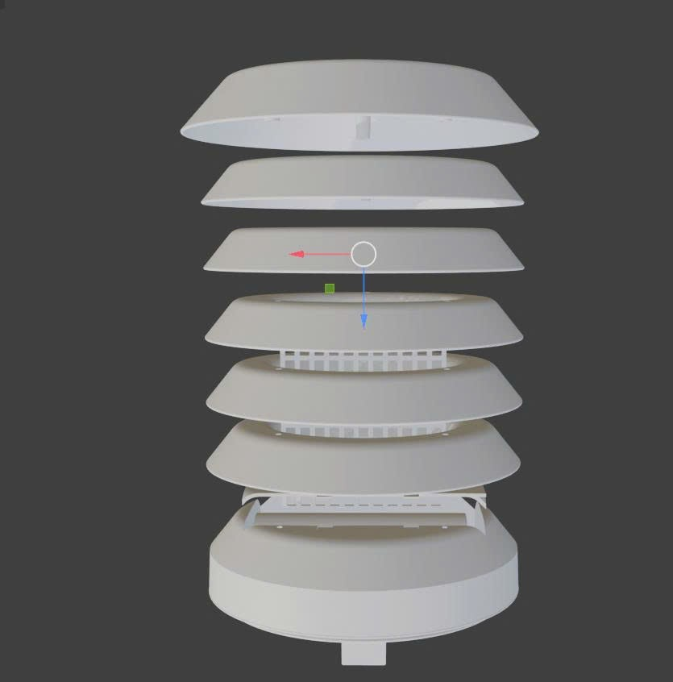

# Wiring & Circuit Description

## ESP8266 NodeMCU Pin Connections

### I2C Bus — Shared by ENS160, AHT2x, BMP280

All three I2C sensors share the same two-wire bus. Each device responds to a different address, so no additional selection pins are required.

| ESP8266 Pin | GPIO | Connected To |
|---|---|---|
| D2 | GPIO4 | SDA → ENS160 SDA, AHT2x SDA, BMP280 SDA |
| D1 | GPIO5 | SCL → ENS160 SCL, AHT2x SCL, BMP280 SCL |
| 3.3V | — | VCC of ENS160, AHT2x, BMP280 |
| GND | — | GND of ENS160, AHT2x, BMP280 |

**I2C Addresses**

| Sensor | Address |
|---|---|
| ENS160 | 0x53 (ADDR pin → VCC) or 0x52 (ADDR pin → GND) |
| AHT20/AHT21 | 0x38 (fixed) |
| BMP280 | 0x76 (SDO → GND) or 0x77 (SDO → VCC) |

> **Pull-up resistors:** The I2C bus requires 4.7 kΩ pull-up resistors on SDA and SCL lines to 3.3V. Many breakout boards include these on-board; check your modules before adding external ones.

---

### UART — PMS7003 Particulate Sensor

The PMS7003 uses a binary UART protocol at 9600 baud, 8N1.

| ESP8266 Pin | GPIO | PMS7003 Pin |
|---|---|---|
| D7 | GPIO13 (RX) | TX (pin 4) |
| D8 | GPIO15 (TX) | RX (pin 5) |
| 5V | — | VCC (pin 1) |
| GND | — | GND (pin 2) |

> **Level shifting:** The PMS7003 operates at 3.3V logic levels for UART despite its 5V supply, so direct connection to ESP8266 GPIO is generally safe. Always verify with your specific module's datasheet.

---

### ADC — GUVA-S12SD UV Sensor

| ESP8266 Pin | GUVA-S12SD Pin |
|---|---|
| A0 | OUT |
| 3.3V | VCC |
| GND | GND |

> **Important:** The ESP8266 ADC input accepts a maximum of **1.0V**. The GUVA-S12SD output voltage can reach ~1.1V under intense UV. Add a **10 kΩ / 1 kΩ voltage divider** (ratio ≈ 0.91) between the sensor output and A0 as a precaution.

---

### Power Rails

```
Solar Panel (6V, 6W)
       │
       ▼
BMS 2S (with 2× Li-ion cells)
       │
       ▼ ~7.4V
LM2596S Buck Converter (set to 5V output)
       │
       ├──── 5V → ESP8266 VIN (or USB micro-B) → on-board AMS1117 → 3.3V
       │
       └──── 5V → PMS7003 VCC
```

> The ESP8266 on-board AMS1117 linear regulator provides 3.3V for the MCU and all low-power I2C/ADC sensors. The PMS7003 requires 5V for its fan motor and must be powered directly from the 5V rail.

---

## Wiring Diagram (Textual)

```
                  3.3V ──┬──── ENS160 VCC
                         ├──── AHT2x VCC
                         ├──── BMP280 VCC
                         └──── GUVA-S12SD VCC

                  GND  ──┬──── ENS160 GND
                         ├──── AHT2x GND
                         ├──── BMP280 GND
                         ├──── GUVA-S12SD GND
                         └──── PMS7003 GND

                  D2 (SDA) ─── ENS160 SDA ─── AHT2x SDA ─── BMP280 SDA
                  D1 (SCL) ─── ENS160 SCL ─── AHT2x SCL ─── BMP280 SCL

                  D7 (RX) ──── PMS7003 TX
                  D8 (TX) ──── PMS7003 RX

                  A0 ──[divider 10k/1k]──── GUVA-S12SD OUT

                  VIN (5V) ─── LM2596 output
                  PMS7003 VCC ─ LM2596 output (5V)
```

---

## Actual Wiring Inside Enclosure

The image below shows the exploded layer structure of the sensor shield enclosure, illustrating how the shield layers stack around the sensors.


